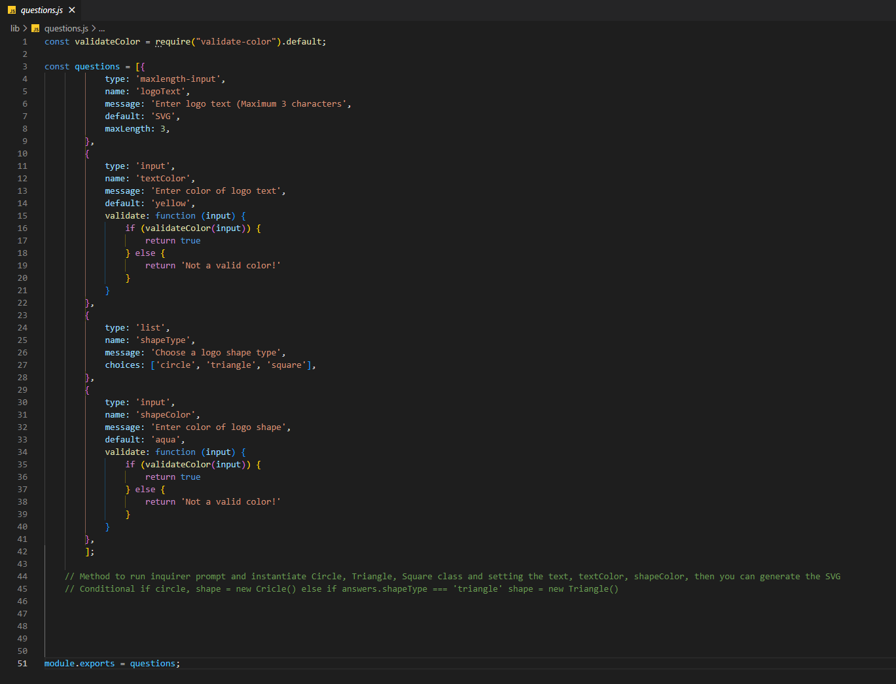

# OOP-SVG-Logo-Maker

## Description

Provide a short description explaining the what, why, and how of your project. Use the following questions as a guide:

A node.js command line application that takes user input to generate a logo and save it as an SVG file. This application can be used to generate a basic logo without the need of a graphic designer. This is done by the user answering prompts in the terminal of vs code. 

## Installation

type "npm i" into terminal of package.json

## Usage

After installation, open index.js file in terminal and type "node index.js". Follow through the prompts with your answers. Upon completion of prompts, your logo.svg file will generate in the examples folder.

 
 Video of application walkthrough:
https://drive.google.com/file/d/1S187pAJ4OigFs7oMWZ2uVR2qsRmxaENe/view?usp=sharing
